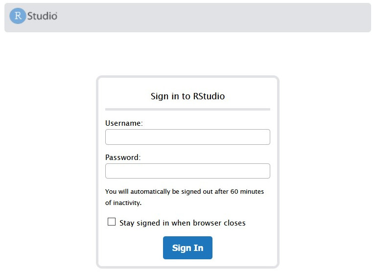
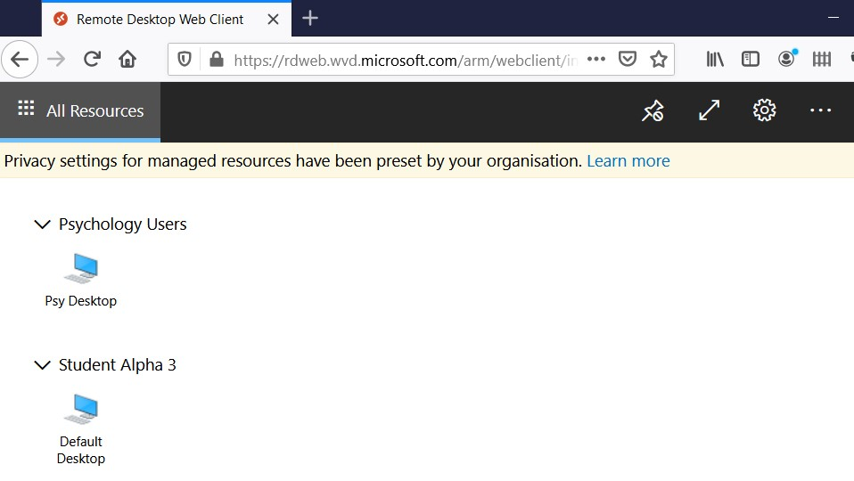
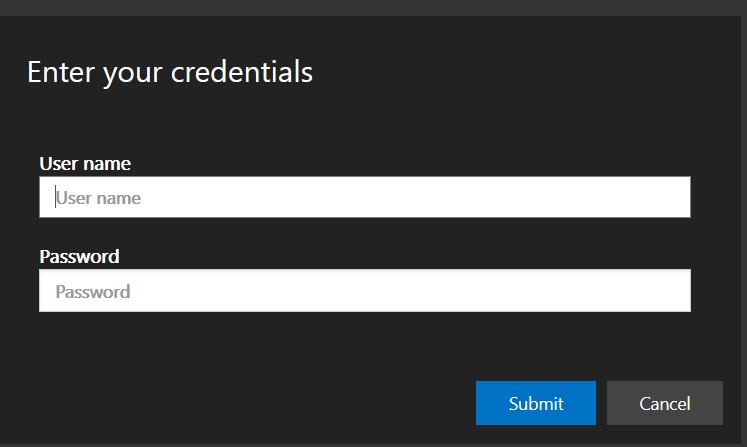
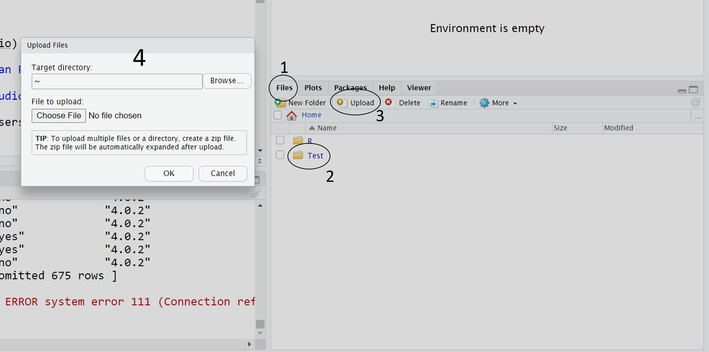
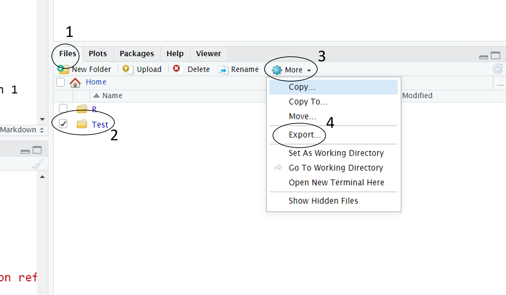

# Installing/Updating R and RStudio

## What is R and RStudio, and how do I get them?

[R](https://www.r-project.org/) is free, open-source software environment for statistical programming and graphics. It is the engine that you will use to do your analyses.

RStudio is an "Integrated Development Environment" (IDE)---a software package developed by the commercial software company [RStudio](https://www.rstudio.com). RStudio is not necessary to use R, but it is highly recommended because it makes it **much** easier to interact with the R engine and develop reproducible scripts compared to working with R alone. RStudio desktop is a free version of this software. There are other IDEs available that work with R, such as [Jupyter notebooks](https://jupyter.org/) and [emacs (with ESS and org-mode)](https://www.gnu.org/software/emacs/). But the software we recommend is RStudio.

We often refer to the combination of these two pieces of software as R/RStudio.

**You have the following options for getting access to R/RStudio:**

- [Install it locally](#local). Both pieces of software are free. The advantage is that you can use them without an internet connection, and you have easy access to the files stored on your hard drive. This is the best long-term solution but installation can sometimes be a hassle ([particularly for Mac users](#catalina)).

- [Use the department's RStudio Server](#server). This is a great option as it doesn't require installing anything on your own system---all you need to do is open a web browser and point it to the right address. It has R, RStudio, and all the add-on packages you might need preinstalled. The disadvantage is that it is requires a stable internet connection, and access to local files can be somewhat tricky. It is great for people new to R/RStudio. If you are a Psychology student at the University of Glasgow, you have free access to this server. Please contact your instructor for the link.

- [Access R/RStudio through Windows Virtual Desktop](#vdesk). Works ok but performance can be sluggish, especially with low-bandwidth network connections. Not recommended unless options 1 and 2 are not viable.

- [Use RStudio Cloud](https://rstudio.cloud/). This is a free cloud service that works well as a temporary option, but without the paid version your options will be limited. Not recommended except as a final fallback option.

### Installing R and RStudio {#local}

This is your best long-term option and is really not too difficult, but if you're new to R/RStudio or not confident with computers, we don't recommend this. 

As far as we are aware at time of writing, R and RStudio do not work well on Chromebooks, Android Tablets or iPads. If this is the only device that you have access to you can try the [RStudio Server](#server). We really recommend a laptop or desktop computer as the ideal machine for your data analysis work.

Michael Galarnyk has very good tutorials for installing R and RStudio on a Mac and a PC. 

**The basic thing to remember is install R first and only then install RStudio.**

[For installing on a Mac](https://medium.com/@GalarnykMichael/install-r-and-rstudio-on-mac-e911606ce4f4)

[For installing on a PC](https://medium.com/@GalarnykMichael/install-r-and-rstudio-on-windows-5f503f708027)

### Using the Department's RStudio Server {#server}

The RStudio Server is accessed through a browser, and operates nearly identically to R/RStudio running locally despite the fact that it is actually running remotely. However, there are two differences: (1) it can sometimes be slow, depending on the speed of your network connection as well as the load on the server; and (2) you cannot directly access any local files on your hard drive; you must upload them to the server to work with them.

Open a browser and enter the URL of the University of Glasgow Psychology RStudio Server. You will need to get the URL from your class Moodle web page or from your instructor. When you enter the URL you will see:

At the login screen, enter your GUID and password. The result will be an interactive web page that looks just like what you would see if you had installed R/RStudio locally, except it is running on a departmental server. 

If you have login problems, please connect to the university's [Virtual Private Network (VPN)](https://www.gla.ac.uk/myglasgow/it/vpn/) and try again.
If you continue to have problems, please post your problem to a help channel on Teams.

Also, please read the [section on working with files on the server](#serverfiles).

### Using Virtual Desktop {#vdesk}

Virtual Desktop is another browser-based method for getting access to R/RStudio. It will be more laggy than the RStudio Server and also has the same limitation of not being able to see local files, so we don't recommend it except as a fallback option for R/RStudio if you can't access the server for some reason. But if you need to use other software it may be your only option.

When you connect to the Psychology Remote Desktop, it will look like you are working on another computer from your own computer. You will interact with it just like you are working on a standard Windows Desktop, except that it will appear as a web page within your browser. From there, you can access any software that the department has access to and run it "in the cloud."

Open your browser and go to <https://rdweb.wvd.microsoft.com/arm/webclient/>. You might need to go through several sign-in screens until you get to this:

Click on "Psy Desktop" and then you might be asked to log in again on the screen below. Use your GUID and password.

Then you will see what looks like a standard Windows log on screen, and eventually, the desktop. Software can be accessed from the pop-up menu available by clicking on the Windows icon in the bottom left corner of the browser window.

Launch the software you need. For instance, If you want to use RStudio, click on windows icon in the bottom left corner of the browser window and type `rstudio` in the search bar that appears. Then you can click on the app to launch it.

*October 1, 2020. -HP and DB*

## How do I update R, RStudio, and add-on packages to the latest versions?

We recommend that you update all your data skills software and packages at the start of the academic year. That will mean that you are running the same software as members of staff and fellow students and helps collaborative work.

Never do this just before an assignment is due, save updating for when you have a bit of time on your hands.

**IMPORTANT update R first, then update R Studio and then update your packages**

[Nick Hathaway has a set of instructions that work for this](https://bootstrappers.umassmed.edu/bootstrappers-courses/courses/rCourse/Additional_Resources/Updating_R.html){target="_blank"}. The process takes about 20 minutes

To update R itself, you will need to use R rather than RStudio.

The newest version of RStudio has a lovely tool that scans scripts you open for any packages that you don’t have installed so look out for that.

*October 1, 2020. -HP and DB*

## How do I access files when using the RStudio Server? {#serverfiles}

The first thing to note is that the RStudio Server is not a good place to store your data forever.  it is not backed up, so make sure that you download any important work regularly and store on OneDrive.

The undergraduate Level 1 teaching materials has walk-through information about [interacting with the server](https://psyteachr.github.io/ug1-practical/programming-basics.html#getting-to-know-r-studio) as well as [uploading files](https://psyteachr.github.io/ug1-practical/ref1.html#activity-1-upload-data-files-to-the-server). Here is a quick reference guide.

### Loading data into the RStudio Server

1) Select the Files Tab
2) Make a folder for your work (NEVER call it R as that can cause errors)
3) Click Upload
4) Browse to the file on your computer via Choose File – if you upload a zipped folder, the server will automatically unzip it for you 😊

### Downloading files from the RStudio Server

If you just have a single file to download, it's as easy as just clicking on that file in the Files pane of the RStudio Server.

If you have multiple files that you want to download:

1) Select the Files Tab
2) Select the folder of file by ticking the box next to it
3) Click More
4) Click “Export”
5) Rename if you need and click download – it will download to your default downloads space (usually on PCs a folder called downloads). If you select a whole folder, it will download as a zipped folder and you will need to unzip it.

*October 1, 2020. -HP and DB*

