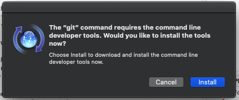
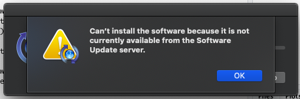
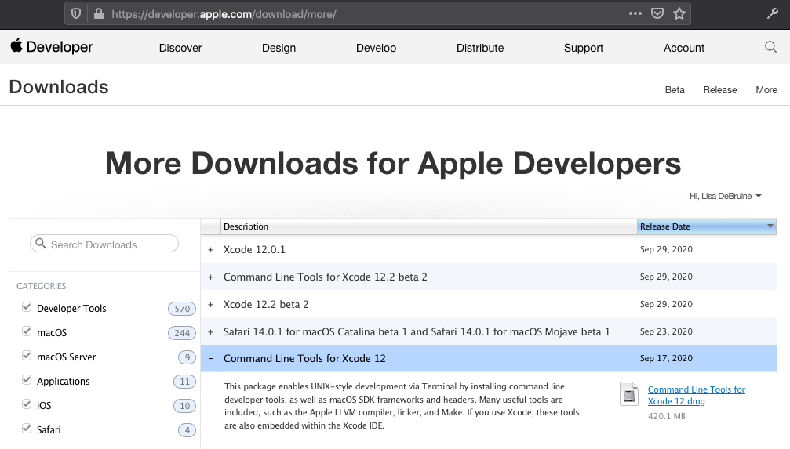
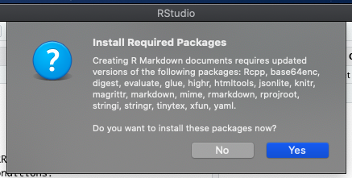
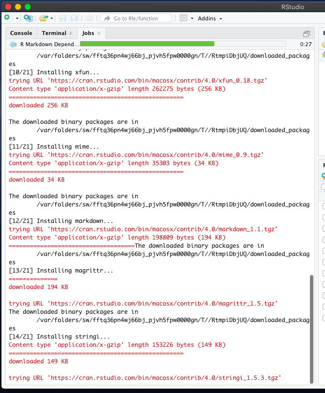

# Installing R and RStudio

## How do I install the R build tools? {#rtools}

If you are not able to install packages from source, you are missing the build tools that are used to compile source code into files that the operating system can execute.

* If you are a Windows user

    - Go to <https://cran.r-project.org/bin/windows/Rtools>. Download and install the "recommended" version.

*October 24, 2019. -DB*

## I'm getting an error when I try to start up RStudio.

### I am on a campus computer, and the error is: "Fatal error: unable to initialize the JIT"

This is due to a bug in your campus profile. Please speak to the [IT Helpdesk](https://www.gla.ac.uk/myglasgow/it/helpdesk/){target="_blank"}.

*November 6, 2019. -DB*

## I am using MacOS 10.15 Catalina

When you first open RStudio, you might get a warning that says:

Click **`Install`** just in case Apple sorts out their probelm so you get the most up to date version. But you're likely to get this error message:

Go to [Apple Developer](https://developer.apple.com/download/more/). You might need to sign in with your Apple ID.

Choose Command Line Tools for Xcode 12 (not the beta) at <https://developer.apple.com/download/more/>. You don't need to install Xcode 12. Download the DMG, open it, and follow the instructions to install it. You will need your computer password.

After you install the command line tools, you can delete the disk image (.dmg file). Quit RStudio if it is open and reopen it. 

You might be asked to install new packages, such as xfun. Just click **`Yes`** to install them. If you are not asked to install packages when you open RStudio, or after you do install them, try to open a new R Markdown file. This will probably prompt more installations.

There will be a lot of red output in the RStudio console, but this is normal. 

After this, try to make a new R Markdown file and knit the demo file to html. You should be all set now.

Thanks to Ashley McCluskey for figuring out where to get the command tools!

*2020 October 1 -LDB*