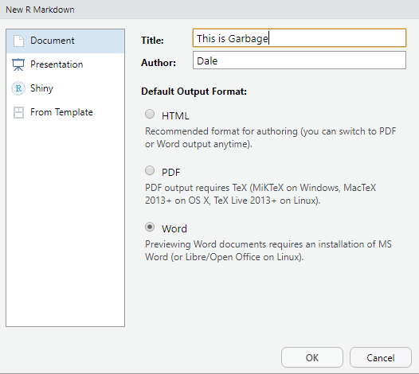
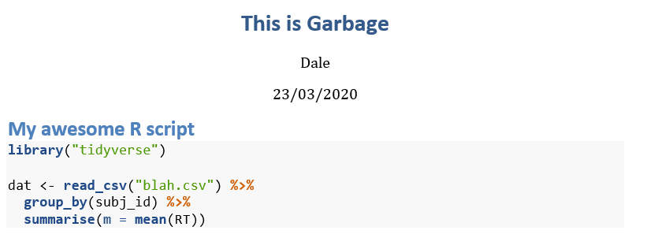

# R Tips and Tricks

## How do I get nicely formatted R code into a Word document?

You might want to include your R code as an appendix in a document. If you just cut and paste it in, the formatting will look terrible. So here is a trick that allows you to get nicely formatted R code into Word.

First step: open a new R Markdown file which you will paste the code into. For the output format, select Word.



Second step: paste the code into a block with chunk options `eval=FALSE, echo=TRUE`.

````
```{r verb, eval = FALSE, echo=TRUE}`r ''`
## this is my code
library("tidyverse")

dat <- read_csv("blah.csv") %>%
  group_by(subj_id) %>%
  summarise(m = mean(RT))
```
````

Third step: compile to Word. You can now copy and paste the formatted code into your document.



*March 23, 2020 -DB*

## Importing data from multiple files

The following code allows you to read in a whole bunch of files from a directory `datadir` all at once into a big table.  If the files are in the same directory as your script, replace `datadir` with a full stop, i.e., `dir(".", "\\.[Cc][Ss][Vv]$")`.

```{r read-them-all, eval = FALSE}
library("tidyverse")

# "\\.csv$" = find all files ending with csv or CSV
todo <- tibble(filename = dir("datadir", "\\.[Cc][Ss][Vv]$"))

all_data <- todo %>%
  mutate(imported = map(filename, read_csv)) %>%
  unnest(imported)
```

If there is preprocessing you need to do on each file before reading it in, you can write your own function and call that in place of `read_csv()`.

*October 30, 2019. -DB*

## Detecting "runs" in a sequence

Let's say you have a table like below, and you want to find the start and end frames where you have a run of `Z` amidst a, b, c, d.  Here is code that sets up this kind of situation. Don't worry if you don't understand this code; just run it to create the example data in `runsdata`, and have a look at that table.

```{r runs-data}
library("knitr")

create_run_vec <- function() {
  ## create a random string of letters with two runs
  c(rep(sample(letters[1:4]), sample(2:4, 4, TRUE)),
               rep("Z", 3),
               rep(sample(letters[1:4]), sample(2:4, 4, TRUE)),
               rep("Z", 3),
               rep(sample(letters[1:4], 2), sample(2:4, 2, TRUE)))
}

## 5 subjects, 3 trials each
runsdata <- tibble(
  subject = rep(1:5, each = 3),
  trial = rep(1:3, 5),
  stimulus = rerun(15, create_run_vec())) %>%
  unnest(stimulus) %>%
  group_by(subject, trial) %>%
  ungroup() %>%
  select(subject, trial, stimulus)

```

Let's say you want to find the start and stop frames where `Z` appears in `stimulus`, and do this independently for each combination of `subject` and `trial`.  Here's how `stimulus` looks for subject 1 and trial 1.

```{r show-runs-data, echo = FALSE}
## knitr::kable(runsdata, format = "html") %>%
##  kableExtra::kable_styling()
s1t1 <- runsdata %>% filter(subject == 1L, trial == 1L) %>% pull(stimulus)

rr <- rle(s1t1 == "Z")
run_start_fr <- c(1L, cumsum(rr$lengths[-length(rr$lengths)]) + 1L)
run_end_fr <- run_start_fr + (rr$lengths - 1L)

zz_start <- run_start_fr[rr$values]
zz_end <- run_end_fr[rr$value]

s1t1
```

So here you can see that the first run of Zs is from frame `r zz_start[1]` to `r zz_end` and the second is from `r zz_start[2]` to `r zz_end[2]`. We want to write a function that processes the data for each trial and results in a table like this:

```{r show-partial-solution, echo = FALSE}
tibble(subject = rep(1, 2), trial = rep(1, 2),
       run = 1:2, start_frame = zz_start,
       end_frame = zz_end)
```

The first thing to do is to add a logical vector to your tibble whose value is `TRUE` when the target value (e.g., `Z`) is present in the sequence, false otherwise.

```{r target-present}
runsdata_tgt <- runsdata %>%
  mutate(is_target = (stimulus == "Z"))

runsdata_tgt
```

We want to iterate over subjects and trials. We'll start by creating a tibble with columns `is_target` nested into a column called `subtbl`.

```{r runs-nest}
runs_nest <- runsdata_tgt %>%
  select(-stimulus) %>% # don't need it anymore
  nest(subtbl = c(is_target))
```

We want to iterate over the little subtables stored within `subtbl` in each row of the table, passing the table to a function that will find the runs and return another table, which we'll store in new column. Let's write a function to detect the runs. That function will need the function `rle()` (Run-Length Encoding) from base R. We'll run that on the logical vector we created (`is_target`). Before creating the function, let's see what `rle()` does on the values in `is_target` for subject 1, trial 1.

```{r rle(s1t1)}
s1t1 <- runsdata_tgt %>% filter(subject == 1L, trial == 1L) %>% pull(is_target)

s1t1

rle(s1t1)
```

If that doesn't make sense, look at the help for `rle()` (type `?rle` in the console). Now we're ready to write our function, `detect_runs()`.

```{r detect-runs}
detect_runs <- function(x) {  
  if (!is.logical(x[[1]])) stop("'x' must be a tibble whose first column is of type 'logical'")
  runs <- rle(x[[1]])
  run_start_fr <- c(1L, cumsum(runs$lengths[-length(runs$lengths)]) + 1L)
  run_end_fr <- run_start_fr + (runs$lengths - 1L)
  
  tgt_start <- run_start_fr[runs$values]
  tgt_end <- run_end_fr[runs$value]
  tibble(run = seq_along(tgt_start),
         start_fr = tgt_start,
         end_fr = tgt_end)
}
```

We can test the function on `s1t1` just to make sure it works.

```{r test-detect-runs}
detect_runs(tibble(lvec = s1t1))
```

OK, now we're ready to run the function.

```{r run-it}
result <- runs_nest %>%
  mutate(runstbl = map(subtbl, detect_runs))

result
```

Now we just have to unnest and we're done!

```{r unnest}
result %>%
  select(-subtbl) %>%
  unnest(runstbl)

```

*October 30, 2019. -DB*

## Highlighting a range of x-values on a plot

Sometimes you want to highlight a particular range of values; for example, a particular period of time in a time series.

The code below is used to create the following plot.

```{r plot, echo = FALSE, fig.cap = "A time series with x = 40-60 highlighted"}
library("tidyverse")

## make up some example data
exdata <- tibble(x = rep(1:100, 2),
                 series = rep(1:2, each = 100),
                 y = rnorm(200) + rep(c(30, 50), each = 100))

## region we want to highlight
regions <- tibble(x1 = 40, x2 = 60, y1 = -Inf, y2 = +Inf)

ggplot(exdata, aes(x, y)) +
  geom_rect(data = regions,
            inherit.aes = FALSE,
            mapping = aes(xmin = x1, xmax = x2,
                          ymin = y1, ymax = y2),
            color = "transparent",
            fill = "blue",
            alpha = .2) +
  geom_line(aes(group = series))
```

```{r code, eval = FALSE}
library("tidyverse")

## make up some example data
exdata <- tibble(x = rep(1:100, 2),
                 series = rep(1:2, each = 100),
                 y = rnorm(200) + rep(c(30, 50), each = 100))

## region we want to highlight
regions <- tibble(x1 = 40, x2 = 60, y1 = -Inf, y2 = +Inf)

ggplot(exdata, aes(x, y)) +
  geom_rect(data = regions,
            inherit.aes = FALSE,
            mapping = aes(xmin = x1, xmax = x2,
                          ymin = y1, ymax = y2),
            color = "transparent",
            fill = "blue",
            alpha = .2) +
  geom_line(aes(group = series))
```

*March 23, 2020. -DB*
