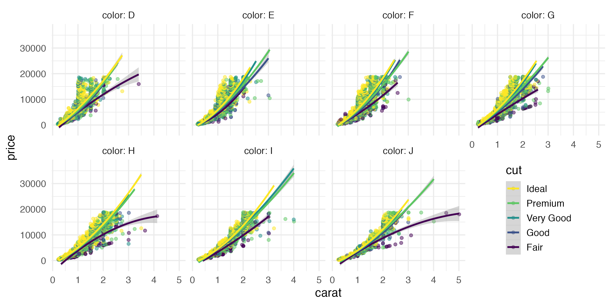

# R Tips and Tricks

## Show R code in Word

How do I get nicely formatted R code into a Word document?

You might want to include your R code as an appendix in a document. If you just cut and paste it in, the formatting will look terrible. So here is a trick that allows you to get nicely formatted R code into Word.

First step: open a new `r glossary("R Markdown")` file which you will paste the code into. For the output format, select Word.


Second step: paste the code into a block with `r glossary("chunk")` options `eval=FALSE, echo=TRUE`.

````
```{r verb, eval = FALSE, echo=TRUE}`r ''`
## this is my code
library("tidyverse")

dat <- read_csv("blah.csv") %>%
  group_by(subj_id) %>%
  summarise(m = mean(RT))
```
````

Third step: compile to Word. You can now copy and paste the formatted code into your document.


*March 23, 2020. -DB*

## Save plots as images

Copying and pasting image from R to Word usually results in images that have very poor resolution and aren't an ideal aspect ratio. You should **always** save plots as images if you are going to use them in another file.

If you are using {ggplot2} to make plots, or {cowplot} to make multi-panel figures, you can save the plot using `ggsave()`. First, make the plot.

```{r, fig.cap="Original Plot"}
ggplot(diamonds, aes(x = carat, y = price, colour = cut)) +
  facet_wrap(~color, ncol = 4, labeller = label_both) +
  geom_point(alpha = 0.5) +
  geom_smooth(method = lm, formula = y~x + I(x^2)) +
  guides(color = guide_legend(reverse = TRUE)) +
  theme_minimal(base_size = 14) +
  theme(legend.position = c(.88, .25))
```

By default, `ggsave()` will save the last plot you made. If you saved the plot to an object, you can also set the `plot` argument to that. Set the filename with .png or .pdf at the end to get the best-quality images. Set the width and height in inches. You might need some trial and error before you're happy with the outcome. You can change the image size and/or the `base_size` in the theme to make the fonts larger or smaller. The image resolution (`dpi`) defaults to 300, and this works well for most purposes, but you can set it to another value if a journal requires figures to be in a specific DPI.

```{r}
ggsave(filename = "images/diamonds.png", width = 10, height = 5)
```

If you want to use the image in an `r glossary("R Markdown")` file, you can use the code below.

```{r, fig.cap="Saved Image"}

```

*March 6, 2021. -LDB*

