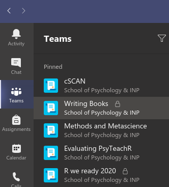
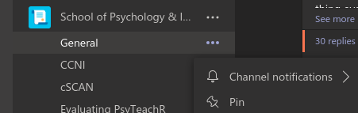
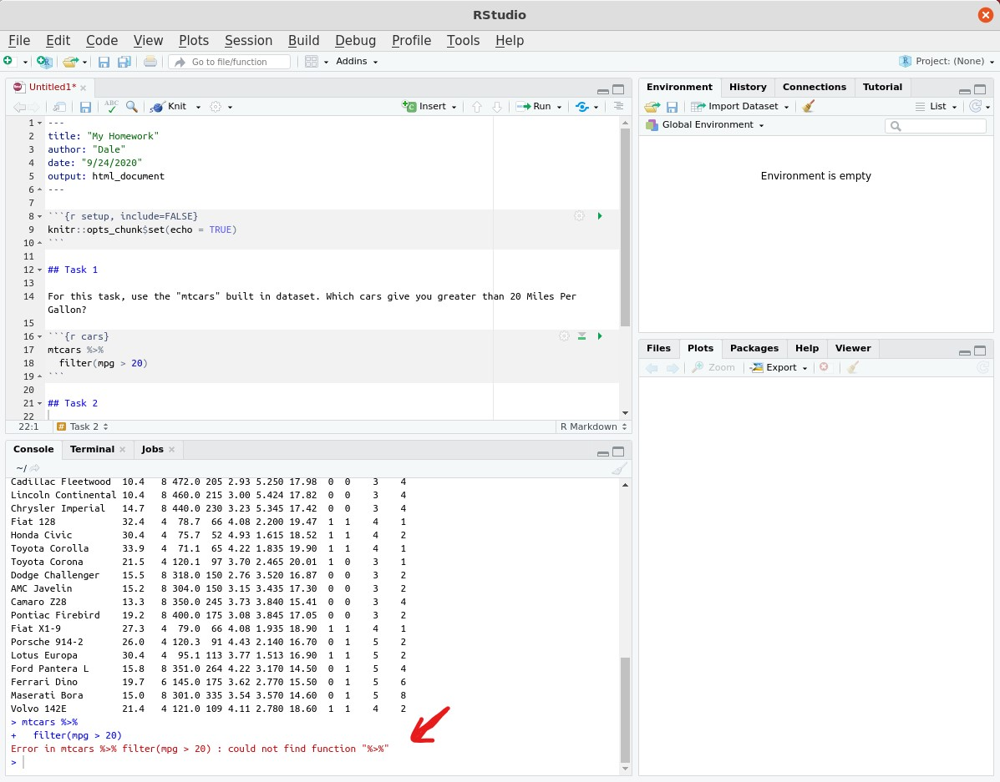
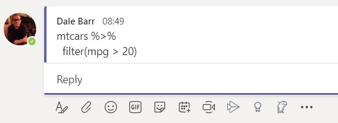
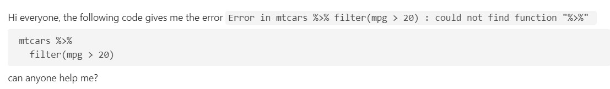
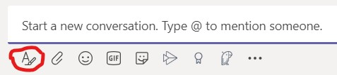
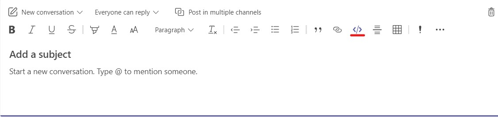
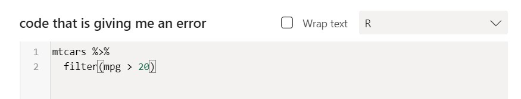
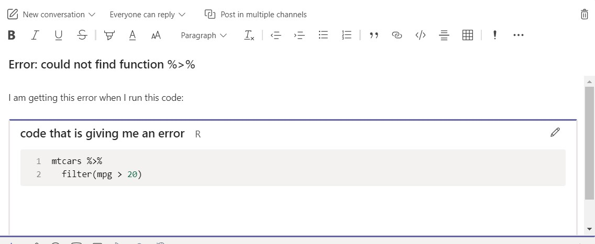

# Microsoft Teams

## Pinning channels

Teams have a way of building up a huge glut of channels, and it can get annoying to have to navigate through them every time just to find the few that you are most interested in. You may even belong to multiple teams. Here's a good solution for reducing clutter: **pin** the channels you are most interested in. They will appear at the top of your screen when you open Teams.



It's easy enough to do. Navigate to the channel you're interested in. Click on the three dots appearing at the right, and from the pop-up menu, select **Pin**. That's it!



## What is the best way to share R code on Microsoft Teams?

You have run into a problem and need to get help on MS Teams. What is the right way to share your code?

Please do *NOT* share a screenshot to the teams channel unless you are asked, or if it is not the code that is giving you problems, but something weird is happening with the RStudio IDE.

If it's your code that is not working, it is almost always better to copy and paste the code, because then people who are trying to help you can copy and paste the code *exactly* to try it out, rather than having to re-type everything from the image. Let's look at an example. Below is a screenshot of how the RStudio IDE might look when your code throws an error. Here the code block labelled `cars` is causing the error. I will talk you through how to post the code on Teams. You might want to play around with these options in your Team's "Test" channel before posting.



The particular error that our code threw was

```
Error in mtcars %>% filter(mpg > 20) : could not find function "%>%"
```

And the code that threw it was

```{r cars, echo = TRUE, eval = FALSE}
mtcars %>%
  filter(mpg > 20)
```

Note that you can select and copy the code above if you wanted to run it yourself, but you could not do that if all you had to rely on was the screenshot.

Copying the code and/or error in RStudio is easy; just highlight the code using the mouse and press Ctrl-C.

If you just paste the code into a teams channel, the formatting is not so nice; you lose the formatting that allows you to read the code easily.



Here are two ways to get your code into teams, one that is quick and easy but not very flexible, and another that is far more flexible but requires more steps.

### Quick and easy method

First, if it is just a short function call, a single line, or an error, you can signal that text is meant to appear as code by surrounding it by single backticks---i.e., putting a backtick (`) right before and right after the text that you want to be formatted as code. Teams will automatically format it for you.

For multi-line code, the easiest and fastest way is just to type three backticks inside your message at the beginning of a line. Any subsequent text you enter will be treated as code. To get to the beginning of a line without submitting your post, press Ctrl-Enter while typing your message. Then type the three backticks, and paste your code right into the gray box that automatically appears. Press Enter twice in a row to get back out of the code entry box. So your message might look like this.



Above, I surrounded the error message `Error in mtcars %>% filter(mpg > 20) : could not find function "%>%"` with single backticks to indicate code, and we typed triple backticks at the start of the line to create a code chunk.

(The next method might be easier for making multi-line posts.)

### More flexible method

There is a more flexible (and possibly easier) way. Before pasting any text, click on the icon that looks like the letter "A", highlighted below.



This will open up options for text formatting and will allow you to easily create a multi-line poste. From those options, select the icon that looks like `</>` which stands for code.



The code icon will open a window where you can paste your code. In the dropdown menu on the top right, select 'R' as the type of code. This will give you syntax highlighting. 



Here is how you might begin your post.



#### Taking it one step further!

If you really want to make things pretty and impress your instructors, please consider creating a reproducible example using the [reprex](https://www.tidyverse.org/help/#reprex) package from tidyverse.

*-September 24, 2020, -DB*
