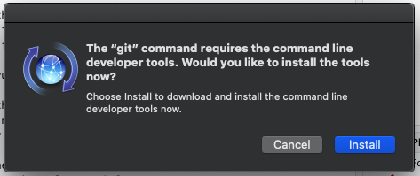
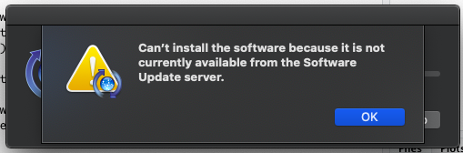
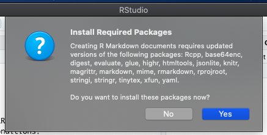

# Troubleshooting R and RStudio

## Every time I knit, I get a message that packages are missing, and it won't knit.

Probably what's happening is that it tries but fails to install the necessary packages. Mark down the names of the packages that it says you need and try to install them from the command line. For example, if it says you need **`digest`** then type this into the console:


```r
install.packages("digest")
```

and see what happens. Note any error messages. Check [the section on packages](add-on-packages.html) for help with specific error messages.

*October 24, 2019. -DB*

## Why can't I compile packages from source?

If you are a Windows user, you are missing RTools. See [this FAQ](installing-r-and-rstudio.html#rtools)

If you are a Mac user, [there might be something wrong with your installation](#xcrun).

*October 24, 2019. -DB*

## When I try to compile, I get the following error message: {#xcrun}

**`xcrun: error: invalid active developer path`**

Solution:

* Open up the Terminal App. (Application>Utilities or you can use the Terminal tab in RStudio, next to the console).
* At the command line in the Terminal type the following line.

```
xcode-select --install
```

*October 24, 2019. -DB*

## I am unable to install add-on packages from source. {#rtools}

If you are not able to install packages from source, you are missing the build tools that are used to compile source code into files that the operating system can execute.

* If you are a Windows user

    - Go to <https://cran.r-project.org/bin/windows/Rtools>. Download and install the "recommended" version.

## RStudio keeps crashing with MacOS 10.15 Catalina {#catalina}

When you first open RStudio, you might get a warning that says:



Click **`Install`** just in case Apple sorts out their problem so you get the most up to date version. But you're likely to get this error message:



Go to [Apple Developer](https://developer.apple.com/download/more/). You might need to sign in with your Apple ID.

Choose Command Line Tools for Xcode 12 (not the beta) at <https://developer.apple.com/download/more/>. You don't need to install Xcode 12. Download the DMG, open it, and follow the instructions to install it. You will need your computer password.


After you install the command line tools, you can delete the disk image (.dmg file). Quit RStudio if it is open and reopen it. 

You might be asked to install new packages, such as xfun. Just click **`Yes`** to install them. If you are not asked to install packages when you open RStudio, or after you do install them, try to open a new R Markdown file. This will probably prompt more installations.



There will be a lot of red output in the RStudio console, but this is normal. 


After this, try to make a new R Markdown file and knit the demo file to html. You should be all set now.

Thanks to Ashley McCluskey for figuring out where to get the command tools!

*2020 October 1 -LDB*

## When I start RStudio, I get the error "Fatal error: unable to initialize the JIT"

This error crops up sometimes when using R on campus computers. This is due to a bug in your campus profile. Please speak to the [IT Helpdesk](https://www.gla.ac.uk/myglasgow/it/helpdesk/){target="_blank"}.

*November 6, 2019. -DB*
