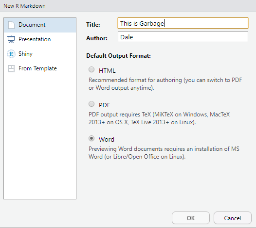
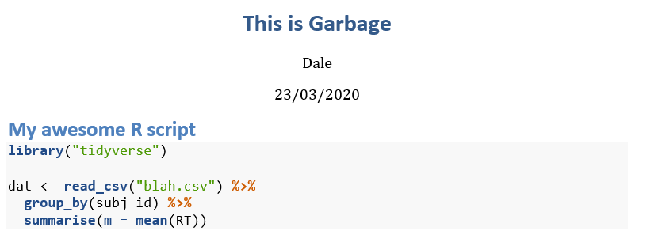
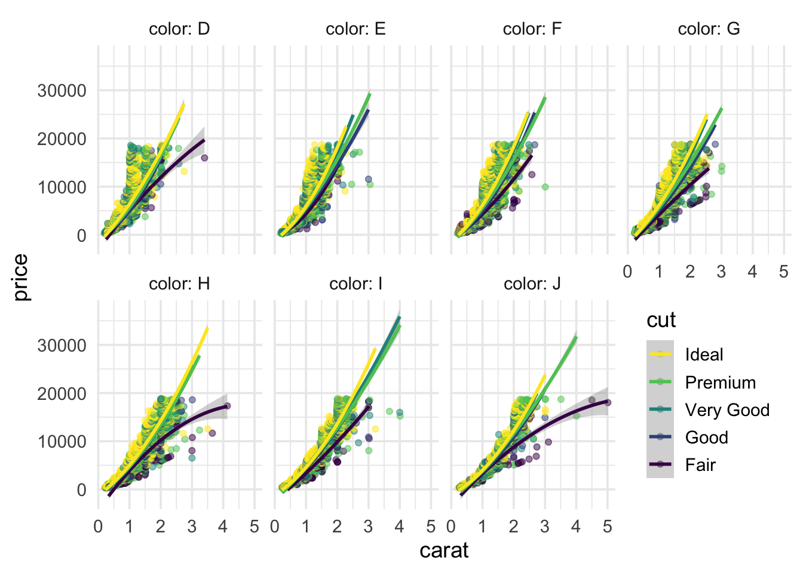
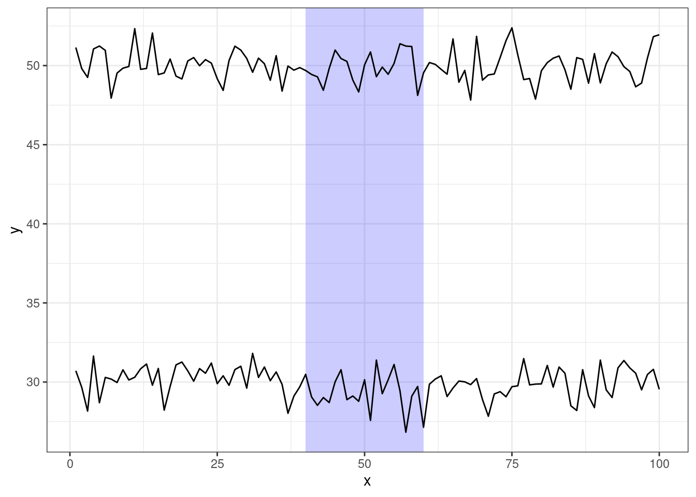

# R Tips and Tricks

## Show R code in Word

How do I get nicely formatted R code into a Word document?

You might want to include your R code as an appendix in a document. If you just cut and paste it in, the formatting will look terrible. So here is a trick that allows you to get nicely formatted R code into Word.

First step: open a new <a class='glossary' target='_blank' title='The R-specific version of markdown: a way to specify formatting, such as headers, paragraphs, lists, bolding, and links, as well as code blocks and inline code.' href='https://psyteachr.github.io/glossary/r#r-markdown'>R Markdown</a> file which you will paste the code into. For the output format, select Word.



Second step: paste the code into a block with <a class='glossary' target='_blank' title='A block of R code in an R Markdown file.' href='https://psyteachr.github.io/glossary/c#chunk'>chunk</a> options `eval=FALSE, echo=TRUE`.

````
```{r verb, eval = FALSE, echo=TRUE}
## this is my code
library("tidyverse")

dat <- read_csv("blah.csv") %>%
  group_by(subj_id) %>%
  summarise(m = mean(RT))
```
````

Third step: compile to Word. You can now copy and paste the formatted code into your document.



*March 23, 2020. -DB*

## Save plots as images

Copying and pasting image from R to Word usually results in images that have very poor resolution and aren't an ideal aspect ratio. You should **always** save plots as images if you are going to use them in another file.

If you are using {ggplot2} to make plots, or {cowplot} to make multi-panel figures, you can save the plot using `ggsave()`. First, make the plot.


```r
ggplot(diamonds, aes(x = carat, y = price, colour = cut)) +
  facet_wrap(~color, ncol = 4, labeller = label_both) +
  geom_point(alpha = 0.5) +
  geom_smooth(method = lm, formula = y~x + I(x^2)) +
  guides(color = guide_legend(reverse = TRUE)) +
  theme_minimal(base_size = 14) +
  theme(legend.position = c(.88, .25))
```

<div class="figure" style="text-align: center">

<p class="caption">(\#fig:unnamed-chunk-1)**CAPTION THIS FIGURE!!**</p>
</div>

By default, `ggsave()` will save the last plot you made. If you saved the plot to an object, you can also set the `plot` argument to that. Set the filename with .png or .pdf at the end to get the best-quality images. Set the width and height in inches. You might need some trial and error before you're happy with the outcome. You can change the image size and/or the `base_size` in the theme to make the fonts larger or smaller. The image resolution (`dpi`) defaults to 300, and this works well for most purposes, but you can set it to another value if a journal requires figures to be in a specific DPI.


```r
ggsave(filename = "images/diamonds.png", width = 10, height = 5)
```

If you want to use the image in an <a class='glossary' target='_blank' title='The R-specific version of markdown: a way to specify formatting, such as headers, paragraphs, lists, bolding, and links, as well as code blocks and inline code.' href='https://psyteachr.github.io/glossary/r#r-markdown'>R Markdown</a> file, you can use the code below.


```r
knitr::include_graphics("images/diamonds.png")
```

<div class="figure" style="text-align: center">

<p class="caption">(\#fig:unnamed-chunk-3)Saved Image</p>
</div>

*March 6, 2021. -LDB*

## Import data from multiple files

The following code allows you to read in a whole bunch of files from a directory `datadir` all at once into a big table.  If the files are in the same directory as your <a class='glossary' target='_blank' title='A plain-text file that contains commands in a coding language, such as R.' href='https://psyteachr.github.io/glossary/s#script'>script</a>, replace `datadir` with a full stop, i.e., `dir(".", "\\.[Cc][Ss][Vv]$")`.


```r
library("tidyverse")

# "\\.csv$" = find all files ending with csv or CSV
todo <- tibble(filename = dir("datadir", "\\.[Cc][Ss][Vv]$"))

all_data <- todo %>%
  mutate(imported = map(filename, read_csv)) %>%
  unnest(imported)
```

If there is preprocessing you need to do on each file before reading it in, you can write your own function and call that in place of `read_csv()`.

*October 30, 2019. -DB*

## Detect "runs" in a sequence

Let's say you have a table like below, and you want to find the start and end frames where you have a run of `Z` amidst a, b, c, d.  Here is code that sets up this kind of situation. Don't worry if you don't understand this code; just run it to create the example data in `runsdata`, and have a look at that table.


```r
library("knitr")

create_run_vec <- function() {
  ## create a random string of letters with two runs
  c(rep(sample(letters[1:4]), sample(2:4, 4, TRUE)),
               rep("Z", 3),
               rep(sample(letters[1:4]), sample(2:4, 4, TRUE)),
               rep("Z", 3),
               rep(sample(letters[1:4], 2), sample(2:4, 2, TRUE)))
}

## 5 subjects, 3 trials each
runsdata <- tibble(
  subject = rep(1:5, each = 3),
  trial = rep(1:3, 5),
  stimulus = rerun(15, create_run_vec())) %>%
  unnest(stimulus) %>%
  group_by(subject, trial) %>%
  ungroup() %>%
  select(subject, trial, stimulus)
```

Let's say you want to find the start and stop frames where `Z` appears in `stimulus`, and do this independently for each combination of `subject` and `trial`.  Here's how `stimulus` looks for subject 1 and trial 1.


```
##  [1] "c" "c" "a" "a" "a" "a" "d" "d" "d" "d" "b" "b" "b" "b" "Z" "Z" "Z" "a" "a"
## [20] "a" "a" "c" "c" "c" "c" "b" "b" "b" "d" "d" "d" "Z" "Z" "Z" "d" "d" "d" "c"
## [39] "c" "c" "c"
```

So here you can see that the first run of Zs is from frame 15 to 17, 34 and the second is from 32 to 34. We want to write a function that processes the data for each trial and results in a table like this:


```
## # A tibble: 2 x 5
##   subject trial   run start_frame end_frame
##     <dbl> <dbl> <int>       <int>     <int>
## 1       1     1     1          15        17
## 2       1     1     2          32        34
```

The first thing to do is to add a logical vector to your tibble whose value is `TRUE` when the target value (e.g., `Z`) is present in the sequence, false otherwise.


```r
runsdata_tgt <- runsdata %>%
  mutate(is_target = (stimulus == "Z"))

runsdata_tgt
```

```
## # A tibble: 553 x 4
##    subject trial stimulus is_target
##      <int> <int> <chr>    <lgl>    
##  1       1     1 c        FALSE    
##  2       1     1 c        FALSE    
##  3       1     1 a        FALSE    
##  4       1     1 a        FALSE    
##  5       1     1 a        FALSE    
##  6       1     1 a        FALSE    
##  7       1     1 d        FALSE    
##  8       1     1 d        FALSE    
##  9       1     1 d        FALSE    
## 10       1     1 d        FALSE    
## # … with 543 more rows
```

We want to iterate over subjects and trials. We'll start by creating a tibble with columns `is_target` nested into a column called `subtbl`.


```r
runs_nest <- runsdata_tgt %>%
  select(-stimulus) %>% # don't need it anymore
  nest(subtbl = c(is_target))
```

We want to iterate over the little subtables stored within `subtbl` in each row of the table, passing the table to a function that will find the runs and return another table, which we'll store in new column. Let's write a function to detect the runs. That function will need the function `rle()` (Run-Length Encoding) from base R. We'll run that on the logical vector we created (`is_target`). Before creating the function, let's see what `rle()` does on the values in `is_target` for subject 1, trial 1.


```r
s1t1 <- runsdata_tgt %>% filter(subject == 1L, trial == 1L) %>% pull(is_target)

s1t1

rle(s1t1)
```

```
##  [1] FALSE FALSE FALSE FALSE FALSE FALSE FALSE FALSE FALSE FALSE FALSE FALSE
## [13] FALSE FALSE  TRUE  TRUE  TRUE FALSE FALSE FALSE FALSE FALSE FALSE FALSE
## [25] FALSE FALSE FALSE FALSE FALSE FALSE FALSE  TRUE  TRUE  TRUE FALSE FALSE
## [37] FALSE FALSE FALSE FALSE FALSE
## Run Length Encoding
##   lengths: int [1:5] 14 3 14 3 7
##   values : logi [1:5] FALSE TRUE FALSE TRUE FALSE
```

If that doesn't make sense, look at the help for `rle()` (type `?rle` in the console). Now we're ready to write our function, `detect_runs()`.


```r
detect_runs <- function(x) {  
  if (!is.logical(x[[1]])) stop("'x' must be a tibble whose first column is of type 'logical'")
  runs <- rle(x[[1]])
  run_start_fr <- c(1L, cumsum(runs$lengths[-length(runs$lengths)]) + 1L)
  run_end_fr <- run_start_fr + (runs$lengths - 1L)
  
  tgt_start <- run_start_fr[runs$values]
  tgt_end <- run_end_fr[runs$value]
  tibble(run = seq_along(tgt_start),
         start_fr = tgt_start,
         end_fr = tgt_end)
}
```

We can test the function on `s1t1` just to make sure it works.


```r
detect_runs(tibble(lvec = s1t1))
```

```
## # A tibble: 2 x 3
##     run start_fr end_fr
##   <int>    <int>  <int>
## 1     1       15     17
## 2     2       32     34
```

OK, now we're ready to run the function.


```r
result <- runs_nest %>%
  mutate(runstbl = map(subtbl, detect_runs))

result
```

```
## # A tibble: 15 x 4
##    subject trial subtbl            runstbl         
##      <int> <int> <list>            <list>          
##  1       1     1 <tibble [41 × 1]> <tibble [2 × 3]>
##  2       1     2 <tibble [37 × 1]> <tibble [2 × 3]>
##  3       1     3 <tibble [33 × 1]> <tibble [2 × 3]>
##  4       2     1 <tibble [36 × 1]> <tibble [2 × 3]>
##  5       2     2 <tibble [34 × 1]> <tibble [2 × 3]>
##  6       2     3 <tibble [37 × 1]> <tibble [2 × 3]>
##  7       3     1 <tibble [37 × 1]> <tibble [2 × 3]>
##  8       3     2 <tibble [39 × 1]> <tibble [2 × 3]>
##  9       3     3 <tibble [33 × 1]> <tibble [2 × 3]>
## 10       4     1 <tibble [36 × 1]> <tibble [2 × 3]>
## 11       4     2 <tibble [35 × 1]> <tibble [2 × 3]>
## 12       4     3 <tibble [38 × 1]> <tibble [2 × 3]>
## 13       5     1 <tibble [37 × 1]> <tibble [2 × 3]>
## 14       5     2 <tibble [41 × 1]> <tibble [2 × 3]>
## 15       5     3 <tibble [39 × 1]> <tibble [2 × 3]>
```

Now we just have to unnest and we're done!


```r
result %>%
  select(-subtbl) %>%
  unnest(runstbl)
```

```
## # A tibble: 30 x 5
##    subject trial   run start_fr end_fr
##      <int> <int> <int>    <int>  <int>
##  1       1     1     1       15     17
##  2       1     1     2       32     34
##  3       1     2     1       14     16
##  4       1     2     2       29     31
##  5       1     3     1       13     15
##  6       1     3     2       26     28
##  7       2     1     1       12     14
##  8       2     1     2       27     29
##  9       2     2     1       11     13
## 10       2     2     2       24     26
## # … with 20 more rows
```

*October 30, 2019. -DB*

## Highlight a range of x-values on a plot

Sometimes you want to highlight a particular range of values; for example, a particular period of time in a time series.

The code below is used to create the following plot.

<div class="figure" style="text-align: center">

<p class="caption">(\#fig:plot)A time series with x = 40-60 highlighted</p>
</div>


```r
library("tidyverse")

## make up some example data
exdata <- tibble(x = rep(1:100, 2),
                 series = rep(1:2, each = 100),
                 y = rnorm(200) + rep(c(30, 50), each = 100))

## region we want to highlight
regions <- tibble(x1 = 40, x2 = 60, y1 = -Inf, y2 = +Inf)

ggplot(exdata, aes(x, y)) +
  geom_rect(data = regions,
            inherit.aes = FALSE,
            mapping = aes(xmin = x1, xmax = x2,
                          ymin = y1, ymax = y2),
            color = "transparent",
            fill = "blue",
            alpha = .2) +
  geom_line(aes(group = series))
```

*March 23, 2020. -DB*
